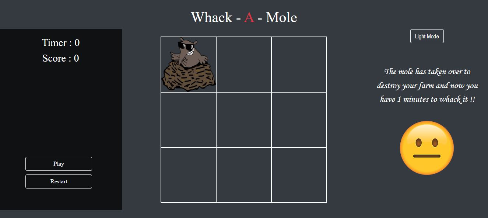
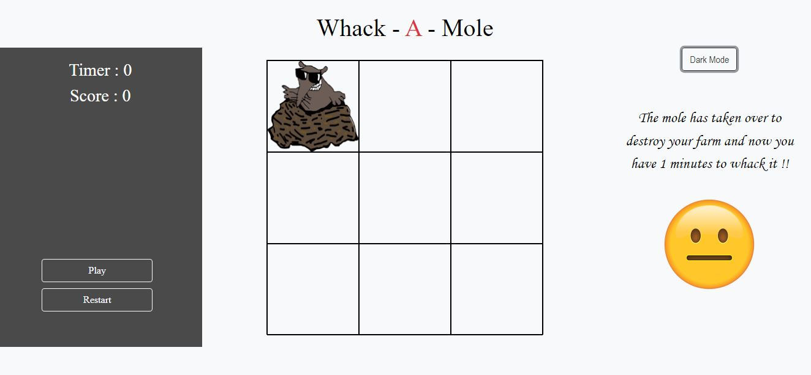

# whack-a-mole-vanilla-js
Whack A Mole game using Vanilla JS 

### Concept 
Whack A Mole is a game concept where you have a mole
popping up from diffrent grids on the screen. You have 
to move the cursor over the grids and tap it, to whack it. 

### Features
1. Dark mode and light mode

### View
 

  

 

 

### Note :- The End score design is just an alert 
